## Part 1. Установка ОС

**== Задание ==**

##### Установи **Ubuntu 20.04 Server LTS** без графического интерфейса. (Используем программу для виртуализации - VirtualBox)

- Графический интерфейс должен отсутствовать.

- Узнай версию Ubuntu, выполнив команду \
`cat /etc/issue.`
- Вставь скриншот с выводом команды.

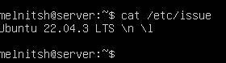
  
## Part 2. Создание пользователя

`-` Установленная система -- это хорошо, но вдруг ей будет пользоваться кто-то ещё? Сейчас научу тебя созданию нового пользователя.

**== Задание ==**

##### Создай пользователя, отличного от созданного при установке. Пользователь должен быть добавлен в группу `adm`.

- Вставь скриншот вызова команды для создания пользователя.

- Новый пользователь должен быть в выводе команды \
`cat /etc/passwd`
- Вставь скриншот с выводом команды.

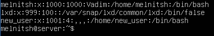
  
## Part 3. Настройка сети ОС

`-` В нашем мире без интернета далеко не уедешь. Однако поскольку мы хотим подготовить тебя к роли системного администратора, я покажу немного больше, чем просто настройку сети.

`-` Перед тем, как приступим, советую почитать про сетевые интерфейсы и DHCP.

**== Задание ==**

##### Задай название машины вида user-1.

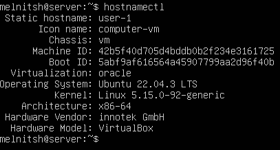

##### Установи временную зону, соответствующую твоему текущему местоположению. 

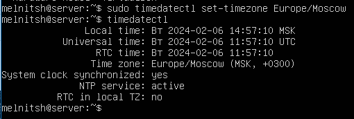

##### Выведи названия сетевых интерфейсов с помощью консольной команды.
- В отчёте дай объяснение наличию интерфейса lo.  

lo (loopback device) – виртуальный интерфейс, присутствующий по умолчанию в любом Linux.
Он используется для отладки сетевых программ и запуска серверных приложений на локальной машине.
С этим интерфейсом всегда связан адрес 127.0.0.1. У него есть dns-имя – localhost.
Посмотреть привязку можно в файле /etc/hosts.

##### Используя консольную команду, получи ip адрес устройства, на котором ты работаешь, от DHCP сервера. 
- В отчёте дай расшифровку DHCP.  

DHCP (Dynamic Host Configuration Protocol) - это протокол, служащий для назначения IP-адреса клиенту. Это облегчает управление сетью, так как администратору не нужно настраивать вручную каждый комп в сети. Данный проотокол упрощает процесс настройки сети и обеспечивает удобство в управлении большими сетями.

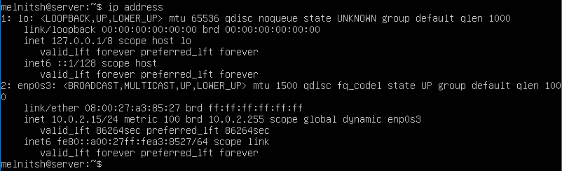

##### Определи и выведи на экран внешний ip-адрес шлюза (ip) и внутренний IP-адрес шлюза, он же ip-адрес по умолчанию (gw). 

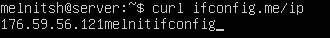 

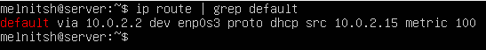

##### Задай статичные (заданные вручную, а не полученные от DHCP сервера) настройки ip, gw, dns (используй публичный DNS серверы, например 1.1.1.1 или 8.8.8.8).  

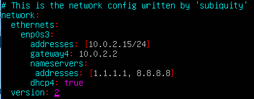

##### Перезагрузи виртуальную машину. Убедись, что статичные сетевые настройки (ip, gw, dns) соответствуют заданным в предыдущем пункте.  

- В отчёте опиши, что сделал для выполнения всех семи пунктов (можно как текстом, так и скриншотами).
- Успешно пропингуй удаленные хосты 1.1.1.1 и ya.ru и вставь в отчёт скрин с выводом команды. В выводе команды должна быть фраза «0% packet loss».

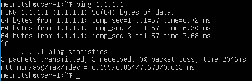

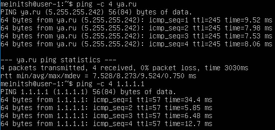

## Part 4. Обновление ОС

`-` Ты спросишь меня: «Готова ли теперь система?». Не готова она совсем! Мы же ещё не обновили её до последней версии.

**== Задание ==**

##### Обнови системные пакеты до последней на момент выполнения задания версии.  

- После обновления системных пакетов, если ввести команду обновления повторно, должно появиться сообщение, что обновления отсутствуют;
- Вставь скриншот с этим сообщением в отчёт.

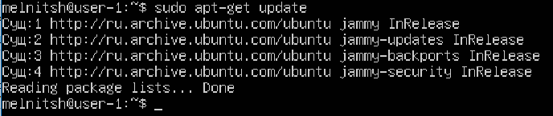

## Part 5. Использование команды **sudo**

`-` Как часто тебе в детстве говорили, что ты забыл сказать «волшебное слово»? Одним из таких «волшебных слов» было «пожалуйста». В Linux есть его аналог - _sudo_. Система не станет выполнять некоторые операции, пока не услышит «волшебное слово».

**== Задание ==**

##### Разреши пользователю, созданному в [Part 2](#part-2-создание-пользователя),выполнять команду sudo.

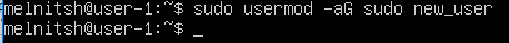

- В отчёте объясни *истинное* назначение команды sudo (про то, что это слово - «волшебное», писать не стоит); 

  Имя команды означает substitute user do или super user do. Утилита позволяет запускать программы от имени другого пользователя, но чаще всего от имени корневого.

- Поменяй hostname ОС от имени пользователя, созданного в пункте [Part 2](#part-2-создание-пользователя) (используя sudo);
- Вставь скрин с изменённым hostname в отчёт.

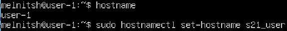

## Part 6. Установка и настройка службы времени

`-` Хоть у нас сейчас и стоит правильное время, оно может быть таким не всегда. Чтобы не настраивать его каждый раз самим, существуют службы синхронизации времени.

**== Задание ==**

##### Настрой службу автоматической синхронизации времени.  

- Выведи время часового пояса, в котором ты сейчас находишься.
- Вывод следующей команды должен содержать `NTPSynchronized=yes`: \
  `timedatectl show`
- Вставь скрины с корректным временем и выводом команды в отчёт.

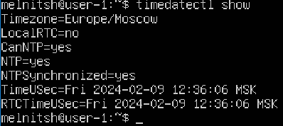

## Part 7. Установка и использование текстовых редакторов 

`-` Думаю, мы готовы перейти к одному из самых страшных этапов. 

На висящей на стене карте мира ты указываешь в сторону Нидерландов:

`-` Здесь Брам Моленар разгадал тайны гармонии и внутренней концентрации. \
Именно здесь 2 ноября 1991 года вышла первая версия . \
Ты хочешь научиться работать в ?

`-` Да.

`-` Тогда я и есть твой мастер.

`-` Хорошо...

`-` Только не плачь.

`-` Ладно...

**== Задание ==**

##### Установи текстовые редакторы **** (+ любые два по желанию ****, **MCEDIT**, **** и т.д.)  

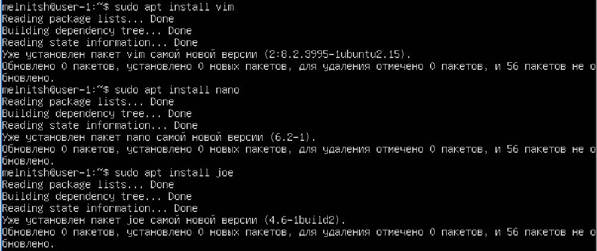

##### Используя каждый из трех выбранных редакторов, создай файл *test_X.txt*, где X -- название редактора, в котором создан файл. Напиши в нём свой никнейм, закрой файл с сохранением изменений.  
- В отчёт вставь скриншоты:
  - Из каждого редактора с содержимым файла перед закрытием;
- В отчёте укажи, что сделал для выхода с сохранением изменений.

Для выхода нажал `Esc`, чтобы перейти в режим команд, затем ввёл `:wq`, чтобы выйти с сохранением.

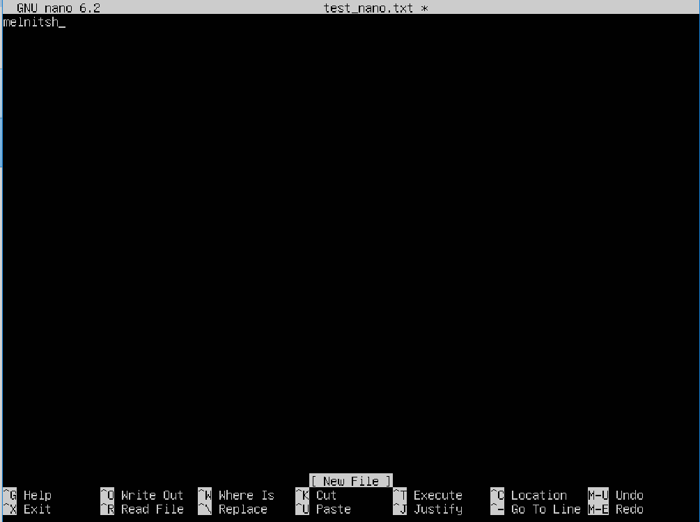

Для выхода нажал `Ctrl+X`, затем сохранить файл и выйти.

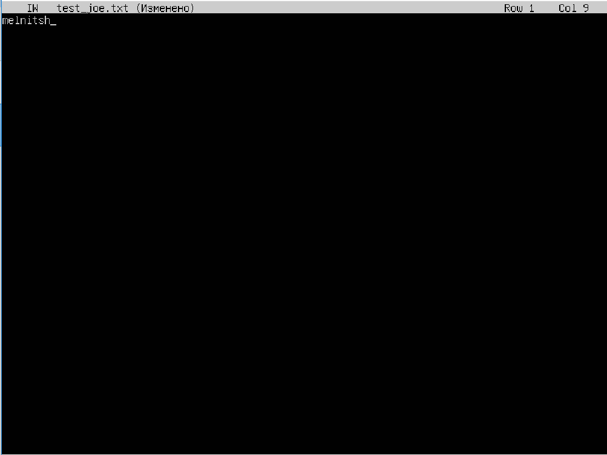

Для выхода с сохранением нажал комбинацию `Ctrl+K+X`.

##### Используя каждый из трех выбранных редакторов, открой файл на редактирование, отредактируй файл, заменив никнейм на строку «21 School 21», закрой файл без сохранения изменений.
- В отчёт вставь скриншоты:
    - Из каждого редактора с содержимым файла после редактирования;
- В отчёте укажи, что сделал для выхода без сохранения изменений.

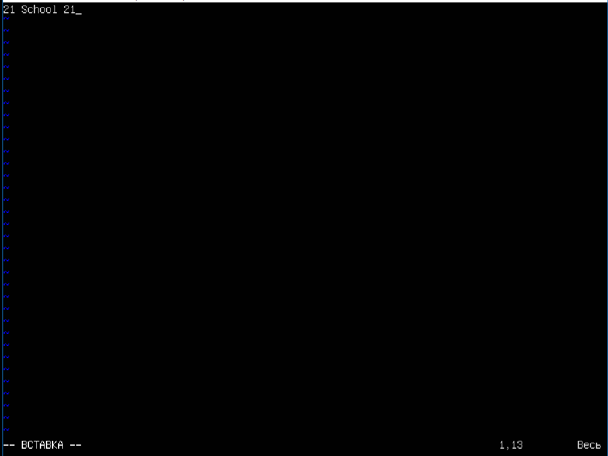

Для перехода в режима редактирования нажал `i`, изменил строку, вышел в обычный режим с помощью `Esc`, а затем ввёл `:q!` для выхода без сохранения.

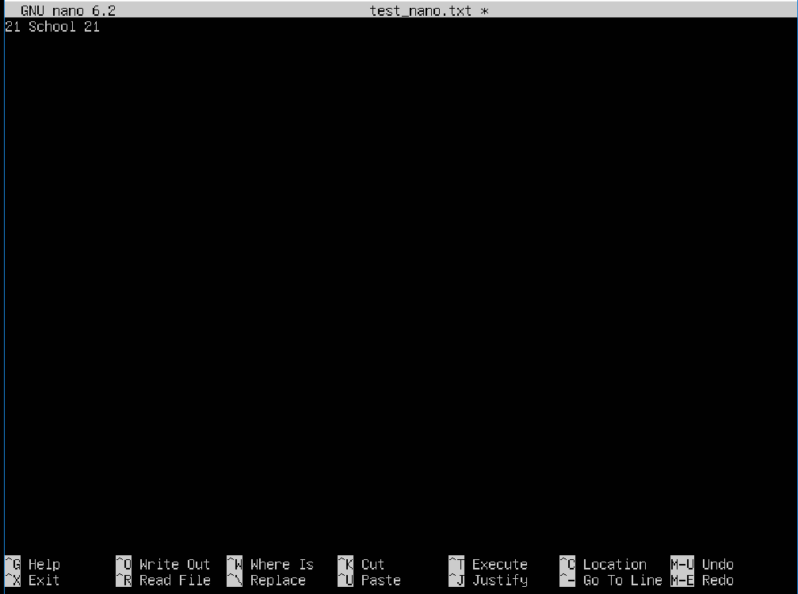

 изначально включается в режиме редактирования, поэтому я поменял строку, ввёл `Ctrl+X` для выхода, а затем `N`, чтобы изменения не сохранились.

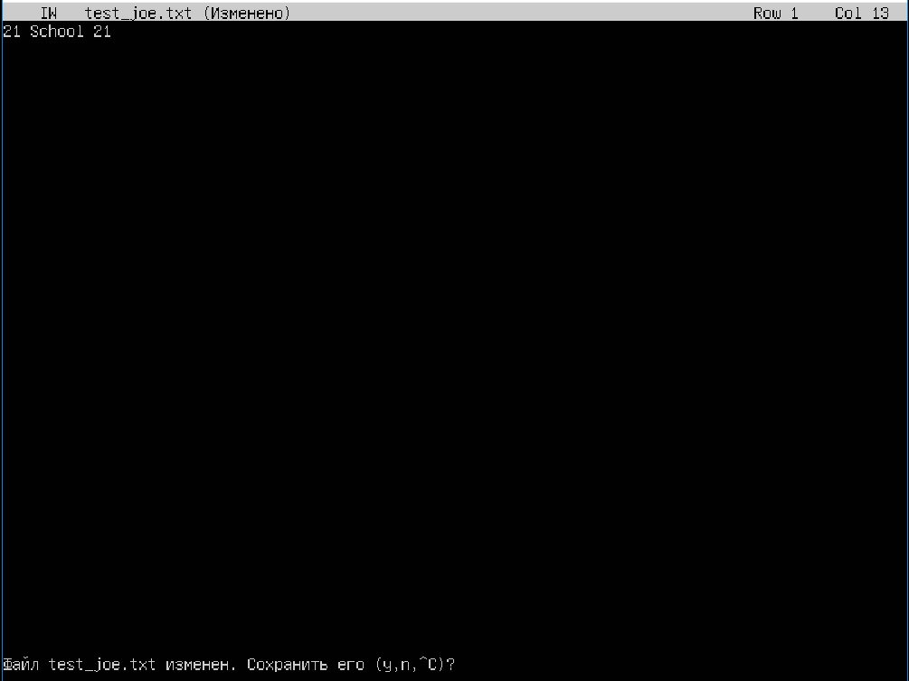

 также изначально позволяет изменять текст, поэтому поменял строку и нажал комбинацию `Ctrl+K+Q`, затем выбрал `N`, чтобы не сохранять.

##### Используя каждый из трех выбранных редакторов, отредактируй файл ещё раз (по аналогии с предыдущим пунктом), а затем освой функции поиска по содержимому файла (слово) и замены слова на любое другое.
- В отчёт вставь скриншоты:
    - Из каждого редактора с результатами поиска слова;
    - Из каждого редактора с командами, введёнными для замены слова на другое.

Vim   
Для поиска надо перейти в командный режим, затем нажать `f` и ввести искомую подстроку. Затем с помощью `n`(вперёд) и `N`(назад) можно переключаться между результатами поиска.

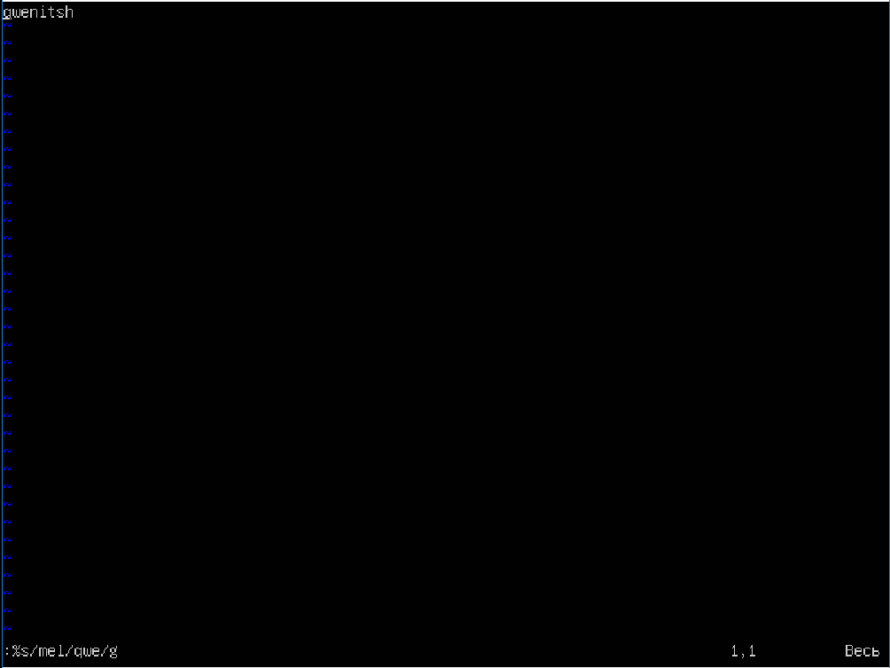

Для замены используется конструкция `:%s/искать/заменить/g`

Nano  
Для поиска используется комбинация `Ctrl+W`, после чего вводится искомое слово, после нажатия `Enter` подсветится ближайшее совпадение (если оно есть).

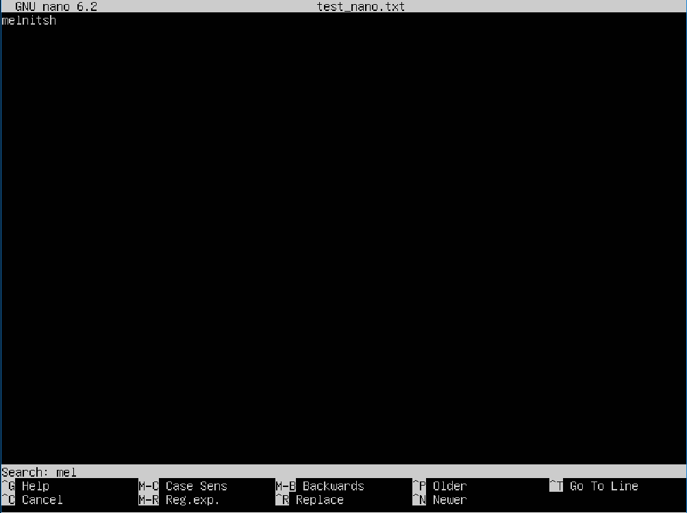

Для замены используется комбинация `Ctrl+\`, затем вводится подстрока которую нужно заменить, затем новая подстрока. После этого подсвечивается ближайшее совпадение, можно либо заменить его, нажав `Y`, либо заменить все совпадения в файле, нажав `A`.

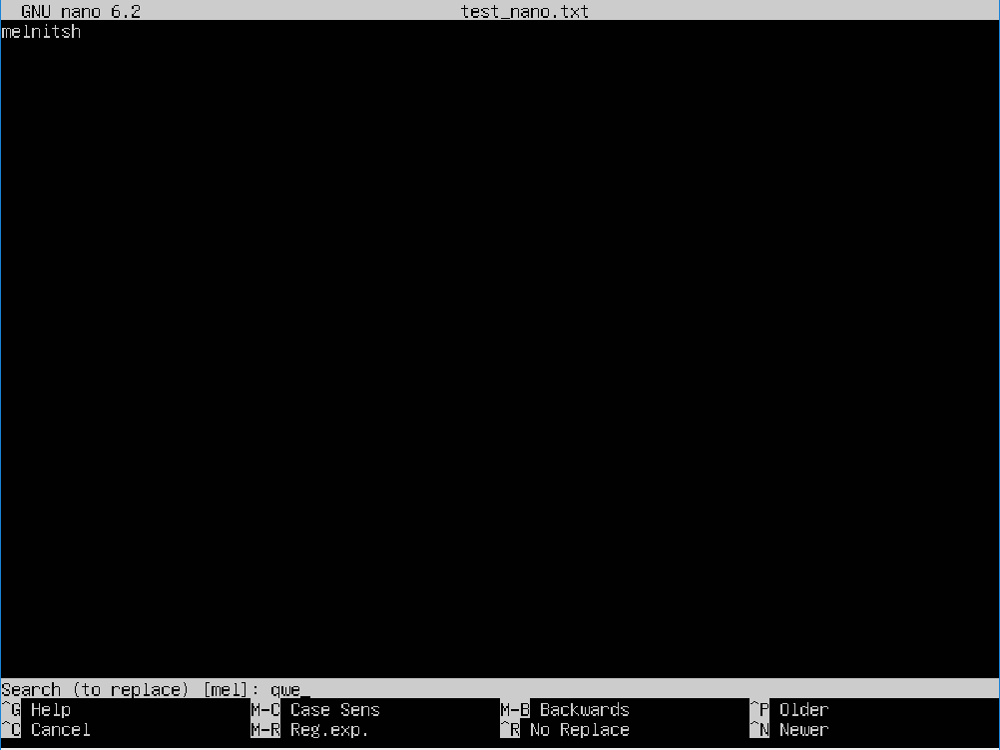

Joe   
Для поиска используется комбинация `Ctrl+K+F`, после чего вводится искомое слово, после нажатия `Enter` дважды курсор переместится на позицию после найденной подстроки, либо выдаст сообщение, что совпадений не найдено.

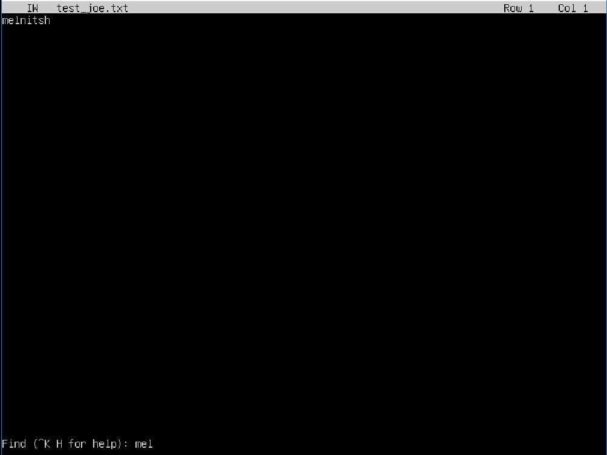

Для замены используется та же комбинация `Ctrl+K+F`, но после первого нажатия `Enter`, нужно ввести опцию `R` и нажать `Enter`, после чего нужно ввести подстроку замены и снова нажать `Enter`. Подсветится найденное совпадение и так же выбор: `Y`-заменить данное совпадение, `R`-заменить все совпадения, `N`-отменить замену.

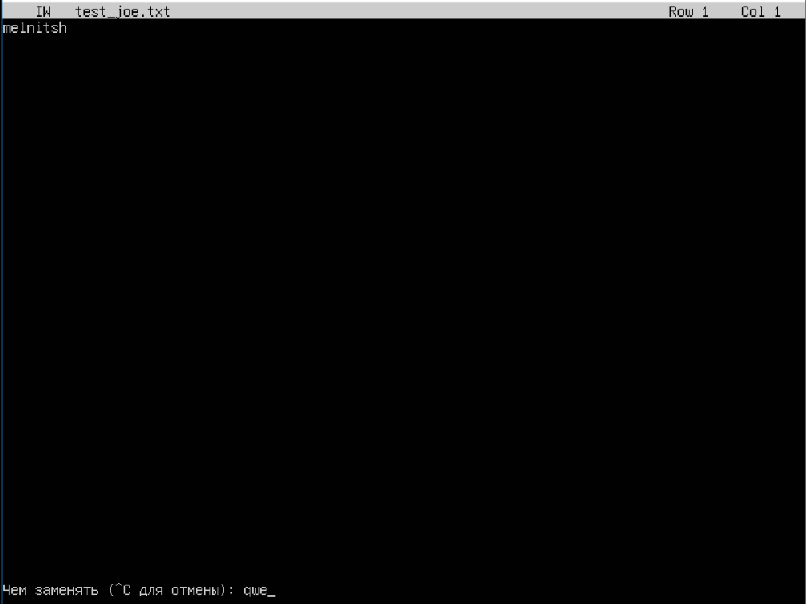

## Part 8. Установка и базовая настройка сервиса **SSHD**

`-` Удобно иметь доступ от одного компьютера к другому по сети, правда? Но чтобы это было не только удобно, но и безопасно, стоит использовать сервис SSH.

**== Задание ==**

##### Установи службу SSHd.  
##### Добавь автостарт службы при загрузке системы.

- Устанавливаем SSH с помощью команды `sudo apt install openssh-server`

- Добавляем автозагрузку `sudo systemctl enable ssh`

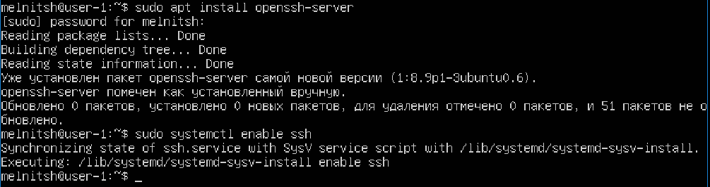

##### Перенастрой службу SSHd на порт 2022.  

- Перенастроим порт 22 в редакторе `sudo vim /etc/ssh/sshd_config`. Т.е. меняем комментарий #Port 22 на #Port 2022

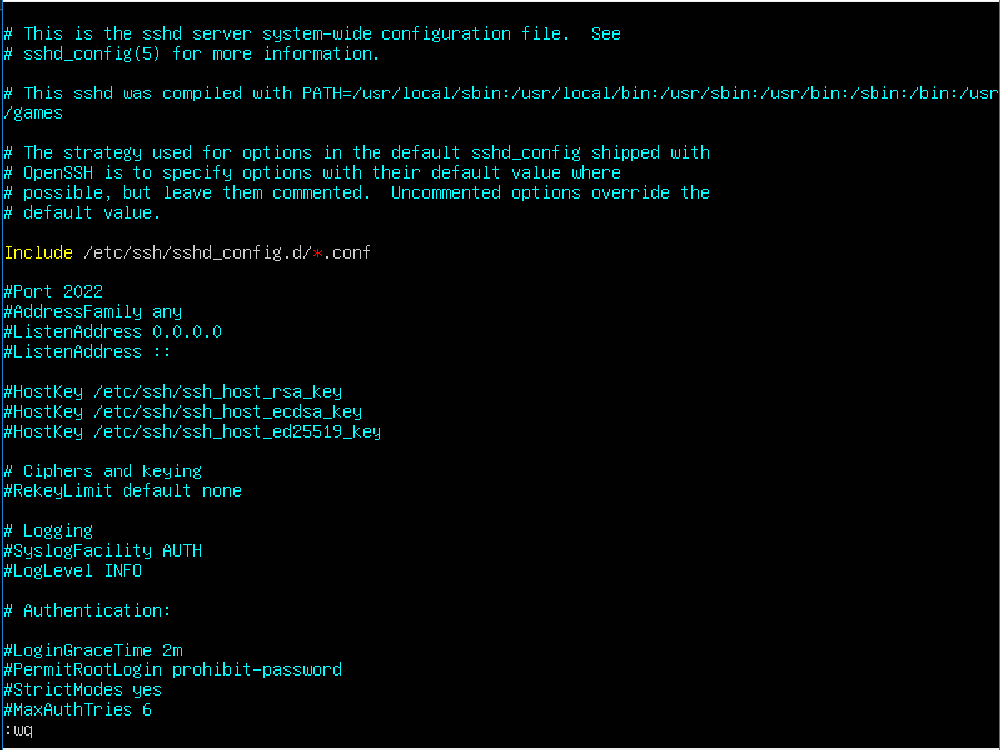

##### Используя команду ps, покажи наличие процесса sshd. Для этого к команде нужно подобрать ключи.
В отчёте объясни значение команды и каждого ключа в ней.

ps - это команда, которая выводит список текущих процессов на вашем сервере в виде таблицы, с которой можно удобно работать: сортировать, изменять количество колонок и прочие. У утилиты ps множество настроек, с помощью которых можно тонко настраивать вывод команды, также никто не запрещает вам делать конвейеры, чтобы отсечь всё лишнее.  
- A, -e, (a) - выбрать все процессы;  
- -a - выбрать все процессы, кроме фоновых;  
- -d, (g) - выбрать все процессы, даже фоновые, кроме процессов сессий;  
- -N - выбрать все процессы кроме указанных;  
- -С - выбирать процессы по имени команды;  
- -G - выбрать процессы по ID группы;  
- -p, (p) - выбрать процессы PID;  
- --ppid - выбрать процессы по PID родительского процесса;  
- -s - выбрать процессы по ID сессии;  
- -t, (t) - выбрать процессы по tty;  
- -u, (U) - выбрать процессы пользователя.

Найдем процесс sshd `ps -A | grep sshd`

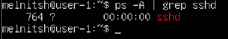

#### Перезагрузи систему.

- Перезапускаем службу `sudo systemctl restart sshd`

- Далее проверяем статус `sudo systemctl status sshd`

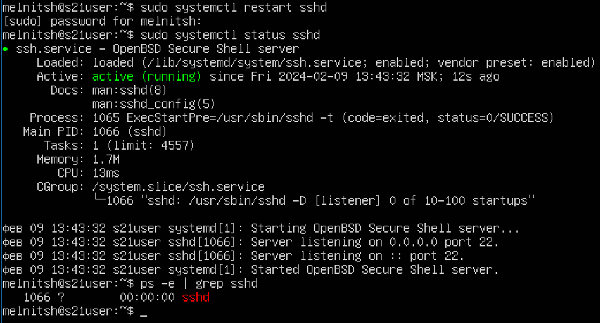

- В отчёте опиши, что сделал для выполнения всех пяти пунктов (можно как текстом, так и скриншотами).
- Вывод команды netstat -tan должен содержать  \
`tcp 0 0 0.0.0.0:2022 0.0.0.0:* LISTEN`  \
(если команды netstat нет, то ее нужно установить)
- Скрин с выводом команды вставь в отчёт.
- В отчёте объясни значение ключей -tan, значение каждого столбца вывода, значение 0.0.0.0.

**Флаги:**
* -t (--tcp) - Отображение текущего подключения в состоянии переноса нагрузки с процессора на сетевой адаптер при передаче данных ( "offload" )
* -a (--all) - Отображение всех подключений и ожидающих портов
* -n (--numeric) - Отображение адресов и номеров портов в числовом формате

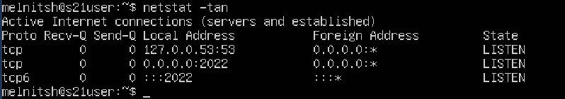

**Значения столбцов:**

* Proto - протокол, используемый сокетом (программноый интерфейс для обеспечения обмена данными между процессами). Так как была использована опция [-t|--tcp], в выводе пристутвуют только TCP-сокеты.
* Recv-Q - счётчик байт, не скопированных программой пользователя из этого сокета.
* Send-Q - счётчик байтов, не подтверждённых удалённым узлом.
* Local Address - адрес и номер порта локального конца сокета. Если указана опция [-n|--numeric], вывод в формате [адрес сокета:номер порта], иначе - [каноническое имя узла:соответствующее имя службы]. 
0.0.0.0 - адрес локального конца сокета, 2022 - номер порта, который мы поменяли с 22 на 2022. Адрес 0.0.0.0 означает, что удаленный конец сокета будет доступен всем локальным ip-адресам.
* Foreign Address - адрес и номер порта удалённого конца сокета.
* State - состояние сокета. Состояние LISTEN означает, что сокет ожидает входящих подключений.

## Part 9. Установка и использование утилит **top**, **htop**

`-` Если бы меня спросили, что полезного делают утилиты **top** и **htop**, я бы ответил одним словом - всё.

**== Задание ==**

##### Установи и запусти утилиты top и htop.  

- По выводу команды top определи и напиши в отчёте:

  - uptime 13 минут
  - количество авторизованных пользователей 1
  - общую загрузку системы 0.00
  - общее количество процессов 94
  - загрузку cpu 0.0
  - загрузку памяти 1964.1 мемибайт (2*20 байт)
  - pid процесса занимающего больше всего памяти 2059(сортировка по памяти - `Shift+M`)
  - pid процесса, занимающего больше всего процессорного времени 658(программа top)

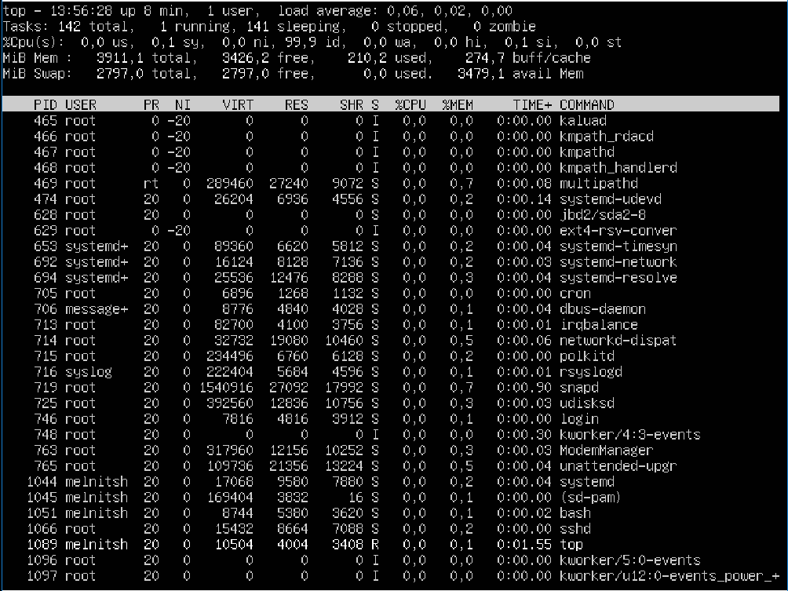

- В отчёт вставь скрин с выводом команды htop:

	Для сортировки искользуется клавиша `F6`, а затем выбирается поле сортировки, нажав `i` перед `Enter` список инвертируется.

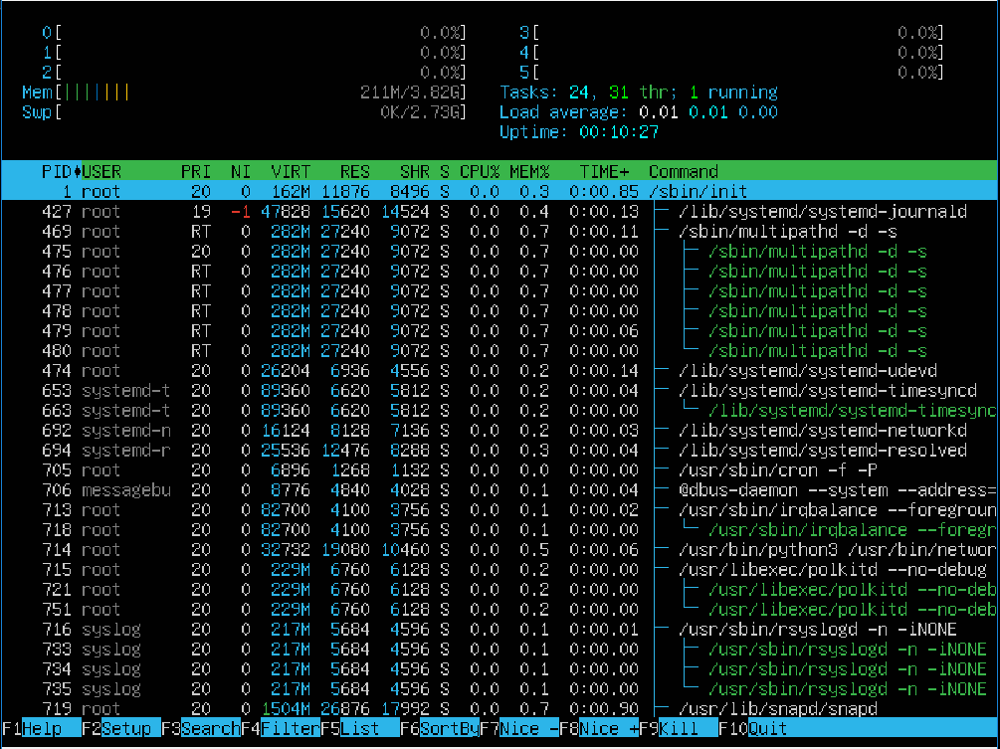

  - отсортированному по PID:  
  

  - отсортированному по PERCENT_CPU:  
  
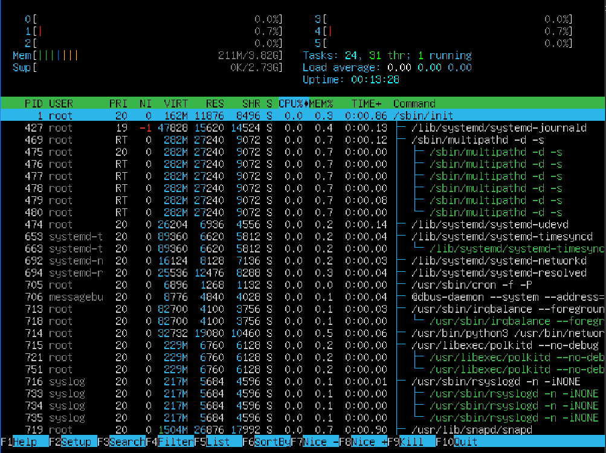
  
  - отсортированному по PERCENT_MEM:  
  
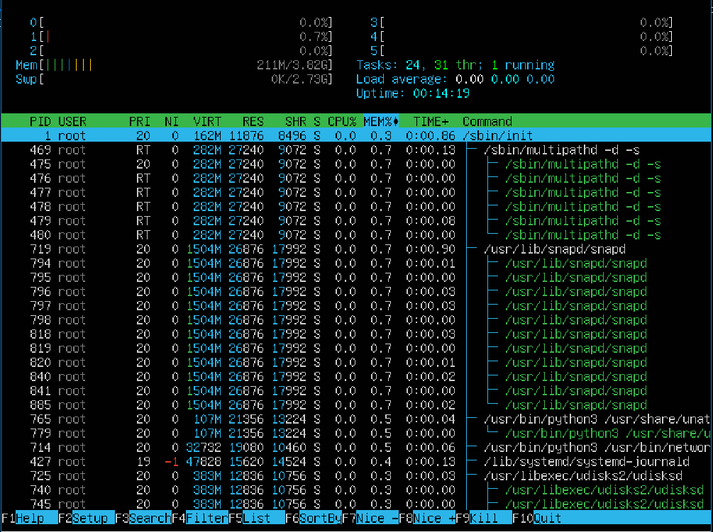

  - отсортированному по TIME:

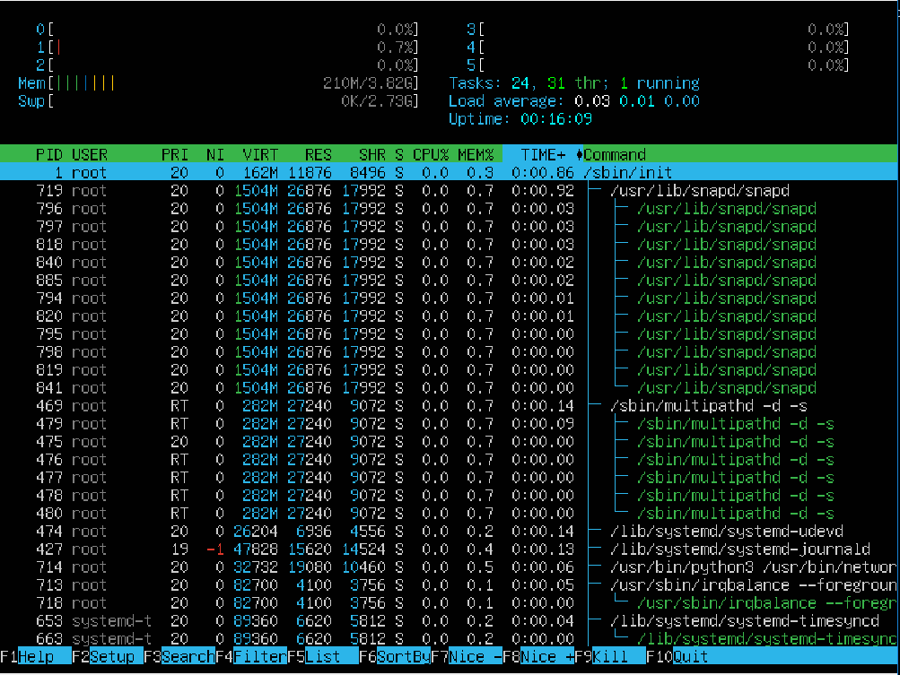

  - отфильтрованному для процесса sshd (нажать `F4`)

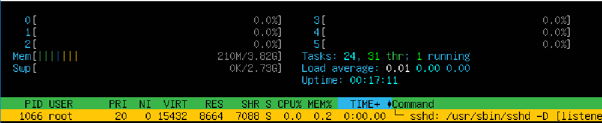

  - с процессом syslog, найденным, используя поиск 
  
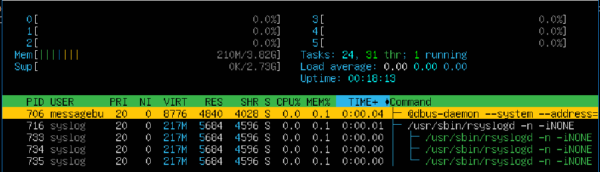
  
  - с добавленным выводом hostname, clock и uptime  

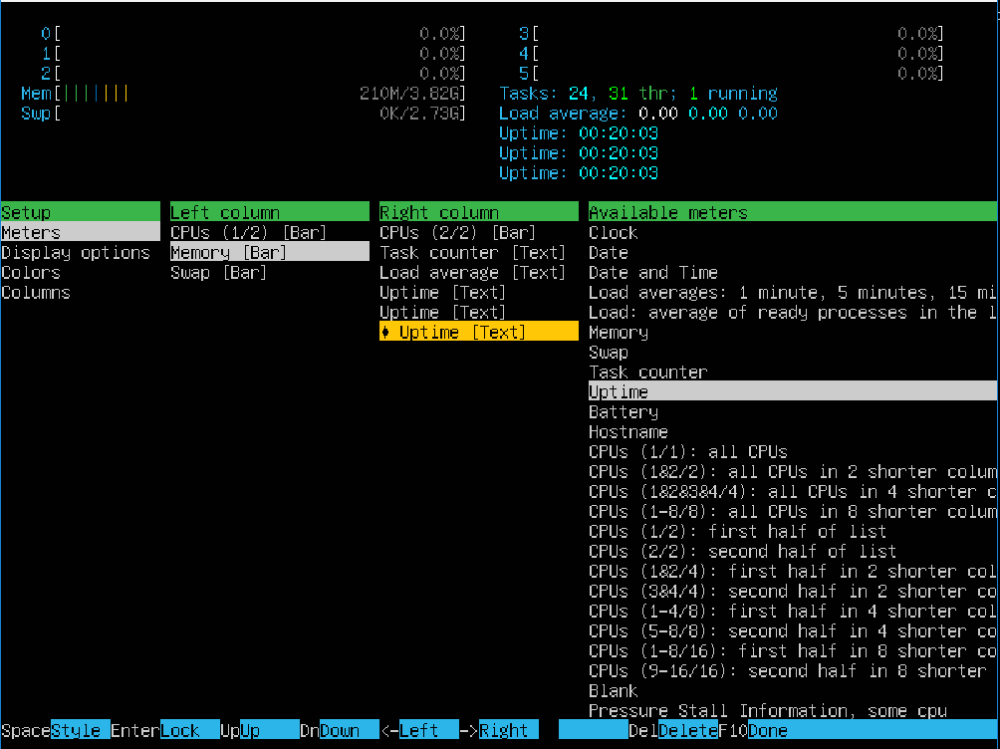

## Part 10. Использование утилиты **fdisk**

`-` Теперь давай разберёмся, как получить информацию о жёстком диске. Специально для тебя я собрал пару примеров работы с утилитой fdisk.

**== Задание ==**

##### Запусти команду fdisk -l.

- В отчёте напиши название жесткого диска, его размер и количество секторов, а также размер swap.

Используем команду `sudo fdisk -l`

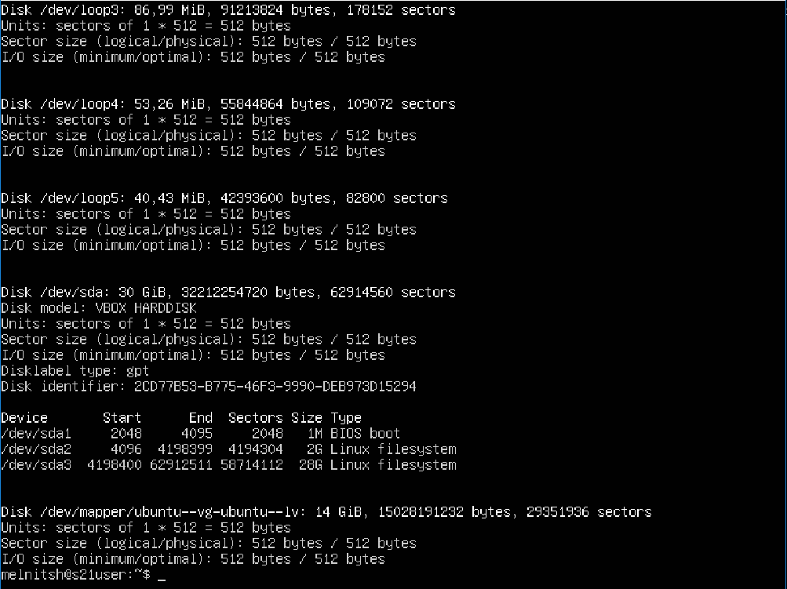

Для размера свапа используем команду `sudo swapon --show` 
Виртуальный жёсткий диск -- /dev/sda, размер 20 гигов, 41943040 секторов

 
Размер свапа -- 1.9 гигабайт, используется 0

## Part 11. Использование утилиты **df** 

`-` Информацию о жёстком диске мы получили, но, зачастую, куда интереснее информация о дисковом пространстве, которую можно получить с помощью утилиты df.

**== Задание ==**

##### Запусти команду df.  
- В отчёте напиши для корневого раздела (/):
  - размер раздела 10218772 Кб
  - размер занятого пространства 4637544 Кб
  - размер свободного пространства 5040556 Кб
  - процент использования 48%
- Определи и напиши в отчёт единицу измерения в выводе. Килобайты  

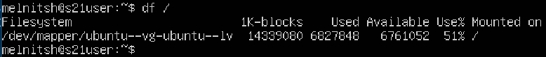

##### Запусти команду df -Th.
- В отчёте напиши для корневого раздела (/):
    - размер раздела 9.8 Гигабайт
    - размер занятого пространства 4.5 Гигабайт
    - размер свободного пространства 4.9 Гигабайт
    - процент использования 48%
- Определи и напиши в отчёт тип файловой системы для раздела.
  - Тип файловой системы ext4

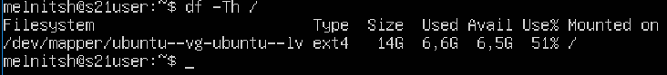

## Part 12. Использование утилиты **du**

`-` df - не единственный способ получить информацию о дисковом пространстве. Сейчас расскажу про ещё один.

**== Задание ==**

##### Запусти команду du
##### Выведи размер папок /home, /var, /var/log (в байтах, в человекочитаемом виде)
##### Выведи размер всего содержимого в /var/log (не общее, а каждого вложенного элемента, используя *)

- В отчёт вставь скрины с выводом всех использованных команд. 
#### 1. /home
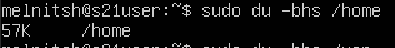
#### 2. /var
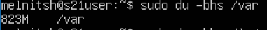
#### 3. /var/log
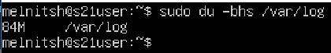

###### Используемые флаги:
- -b -- указать единицы вывода размера, доступно: K,M,G,T,P,E,Z,Y для 1024 и KB, MB и так далее для 1000;
- -h -- выводить размер в единицах измерения удобных для человека;
- -s -- выводить только общий размер;

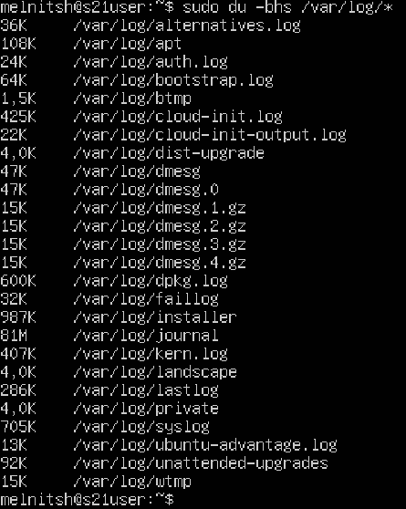

## Part 13. Установка и использование утилиты **ncdu**

`-` Тебе, возможно, не очень понравился формат, в котором команда du выводит информацию. Я тебя прекрасно понимаю. Поэтому сейчас мы рассмотрим её улучшенную версию.

**== Задание ==**

##### Установи утилиту ncdu
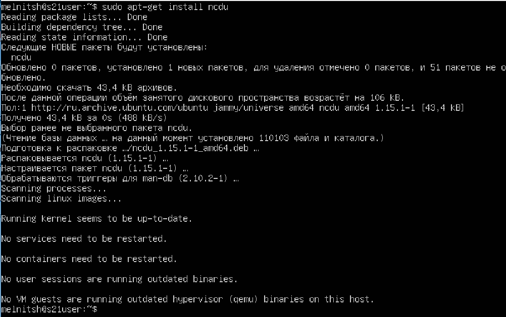
##### Выведи размер папок /home, /var, /var/log

- Размеры должны примерно совпадать с полученными в [Part 12](#part-12-использование-утилиты-du).

- В отчёт вставь скрины с выводом использованных команд.

#### 1. /home
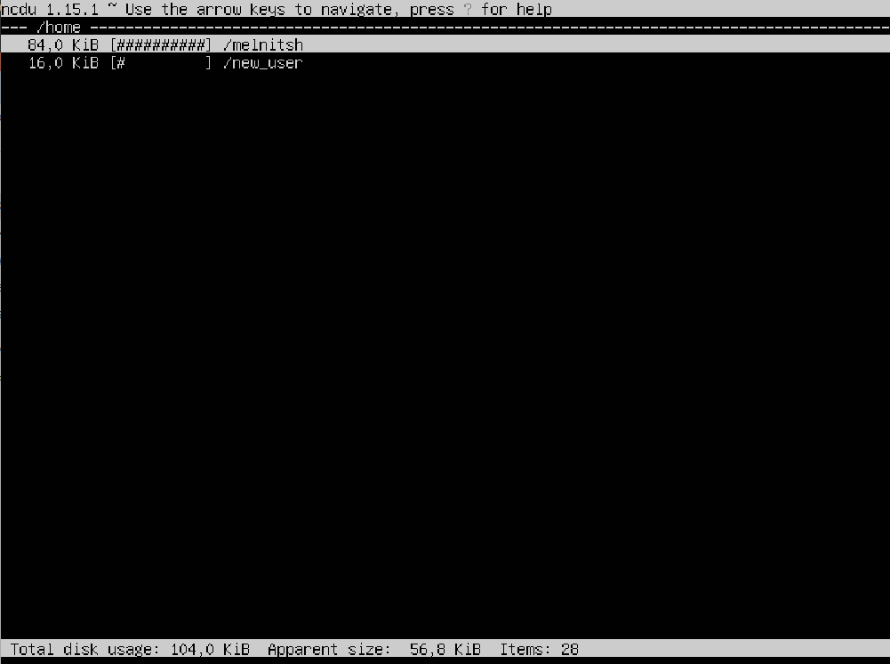
#### 2. /var
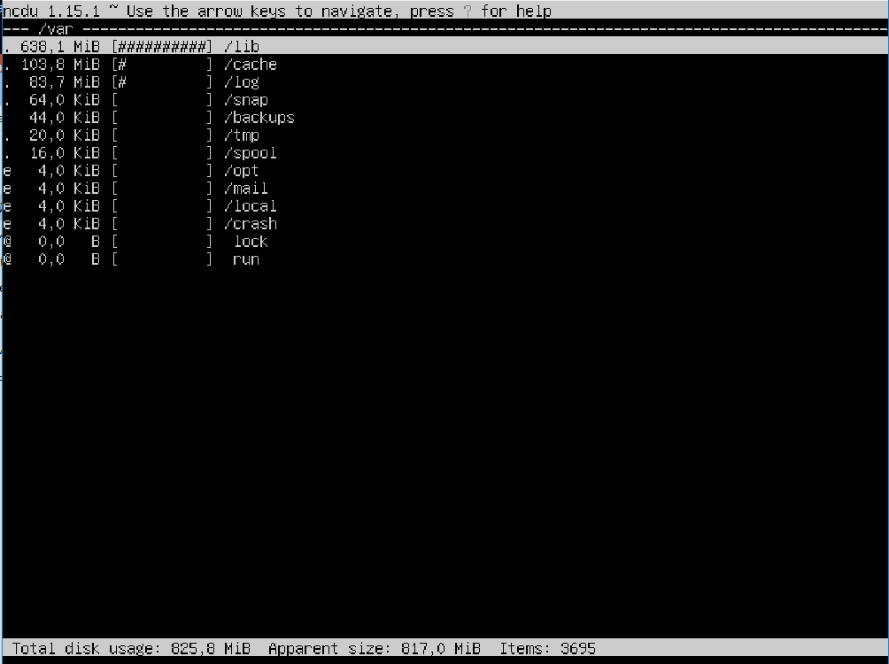
#### 3. /var/log
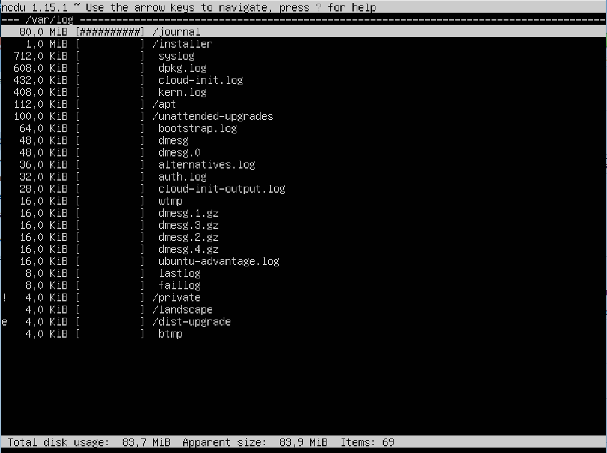

## Part 14. Работа с системными журналами

`-` Системному администратору иногда приходится просматривать события, происходившие в системе в недавнем прошлом. Для этого в Linux есть системные журналы.

**== Задание ==**

#### Открой для просмотра:
#### 1. /var/log/dmesg  
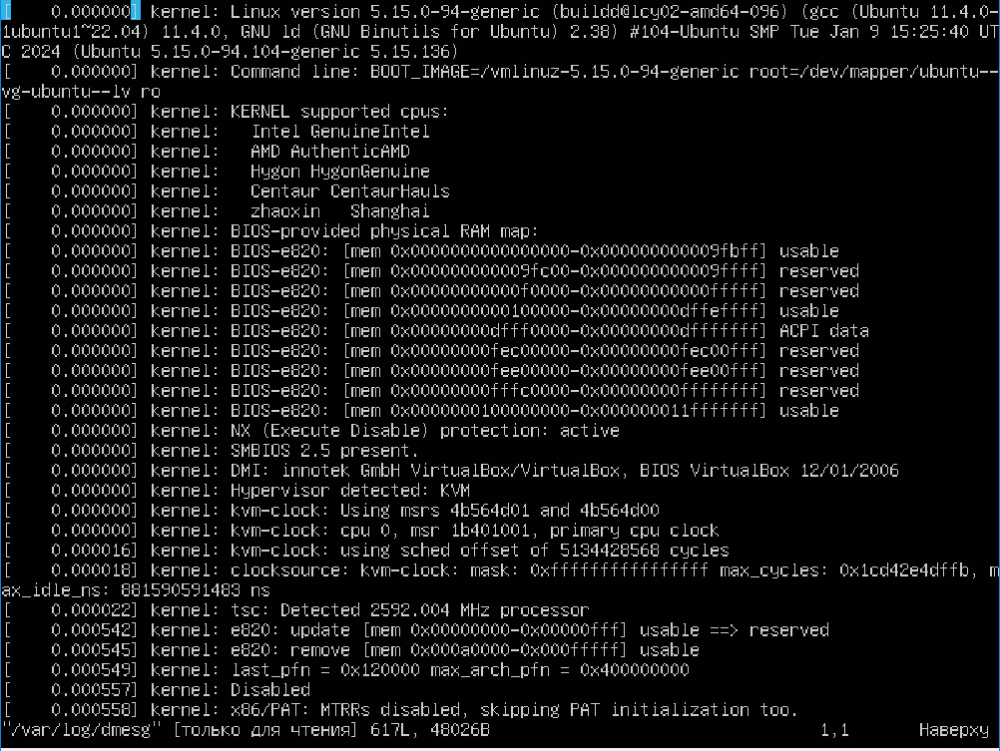
#### 2. /var/log/syslog  
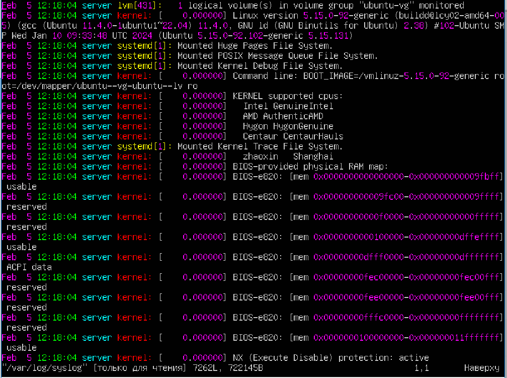
#### 3. /var/log/auth.log  
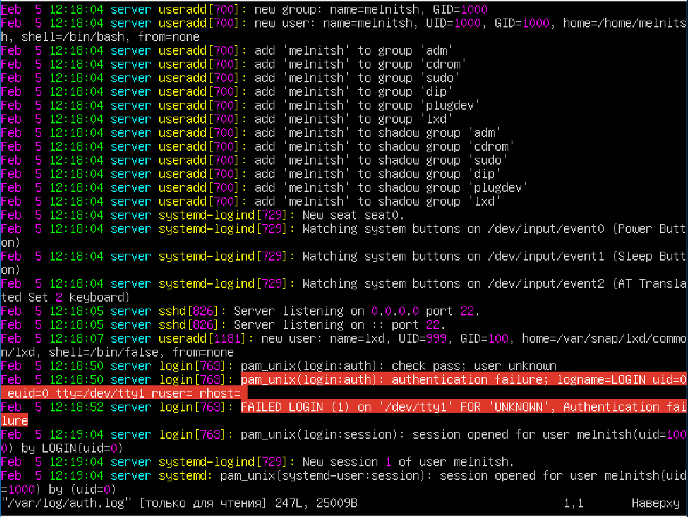

- Напиши в отчёте время последней успешной авторизации, имя пользователя и метод входа в систему;

  Чтобы узнать время последней успешной авторизации, имя пользователя и метод входа в систему, вызываем `sudo grep -a 'login' /var/log/auth.log`
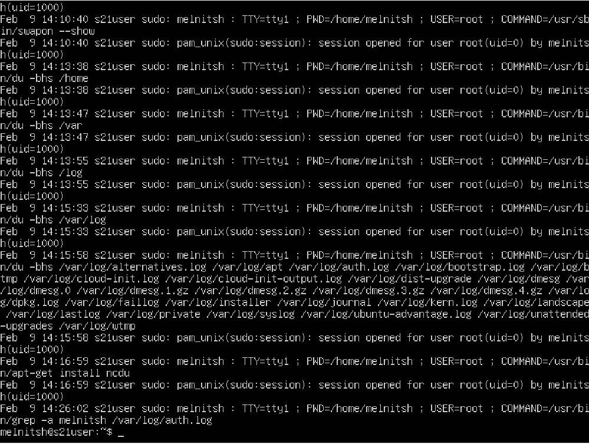

- Перезапусти службу SSHd;
- Вставь в отчёт скрин с сообщением о рестарте службы (искать в логах).

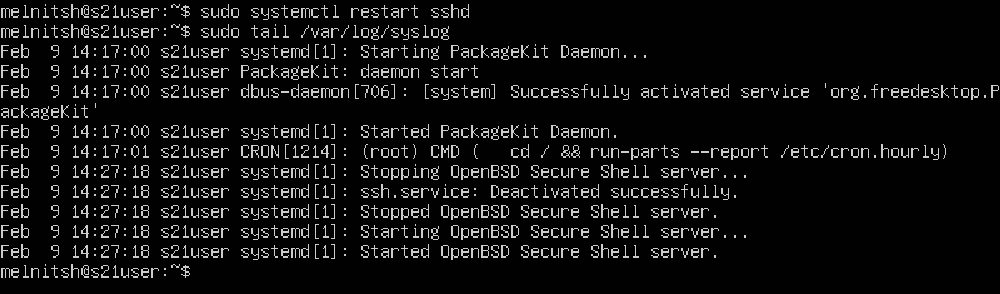

## Part 15. Использование планировщика заданий **CRON**

`-` Фух, наконец-то мы добрались до последней части моего долгого повествования. Сейчас я покажу программу, которая, помимо прочего, заметно упрощает периодический вызов других программ.

**== Задание ==**
##### Используя планировщик заданий, запусти команду uptime через каждые 2 минуты.

Для этого используем команду `crontab -e`, выбираем редактор nano прописываем строку `*/2 * * * * uptime | wall`, которая говорит, что надо запускать скрипт каждые 2 минуты.

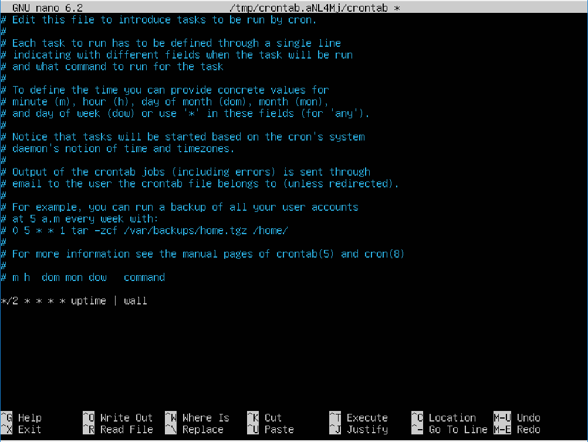

- Найди в системных журналах строчки (минимум две в заданном временном диапазоне) о выполнении;

Для этого снова прописываем `sudo tail /var/log/syslog`.

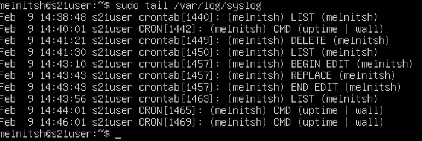

- Выведи на экран список текущих заданий для CRON;

Прописываем команду `crontab -l`

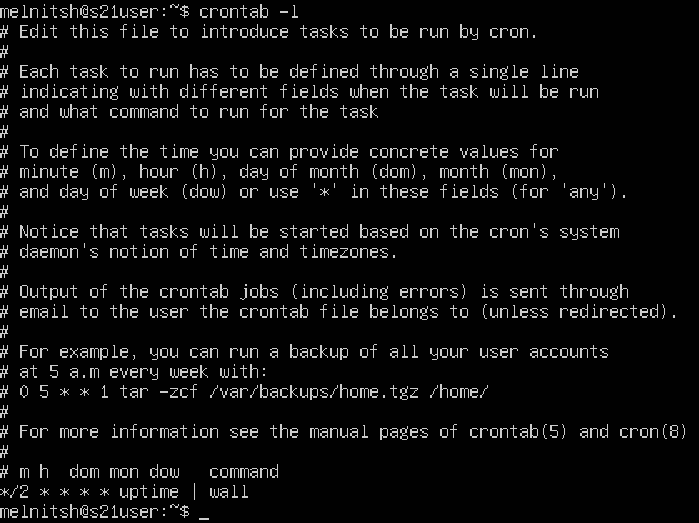

- Вставь в отчёт скрины со строчками о выполнении и списком текущих задач.

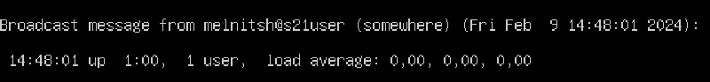

##### Удали все задания из планировщика заданий.
- В отчёт вставь скрин со списком текущих заданий для CRON.

Прописываем `crontab -r`, чтобы удалить все записи и `crontab -l`, чтобы проверить, что записей нет.

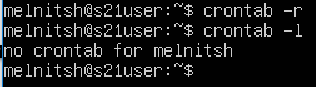